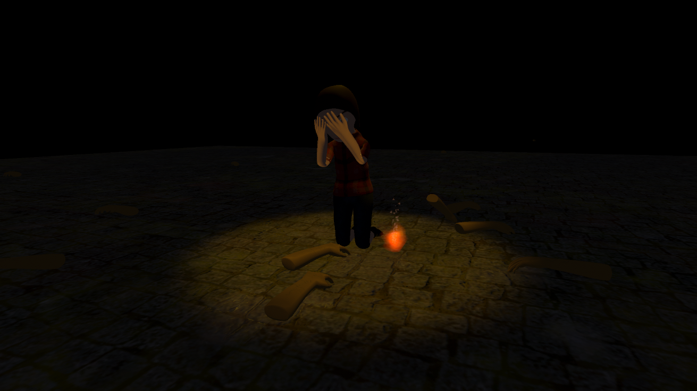
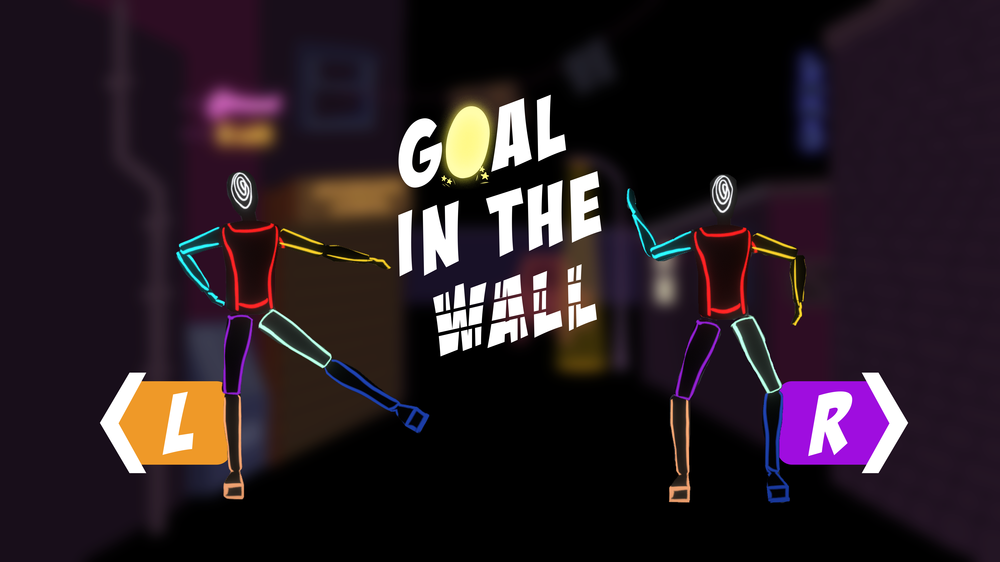
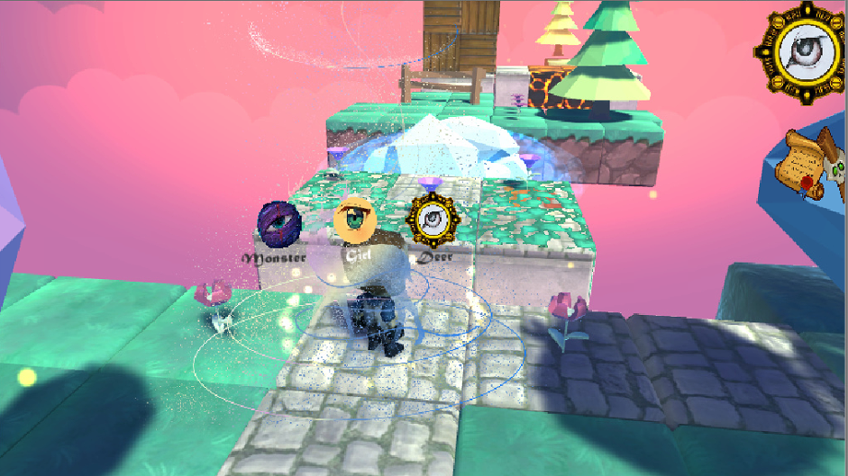
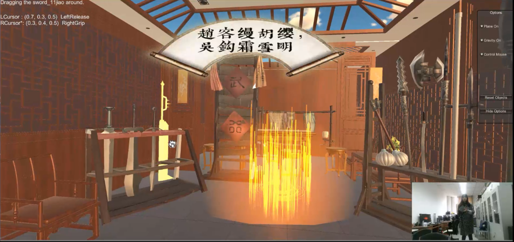
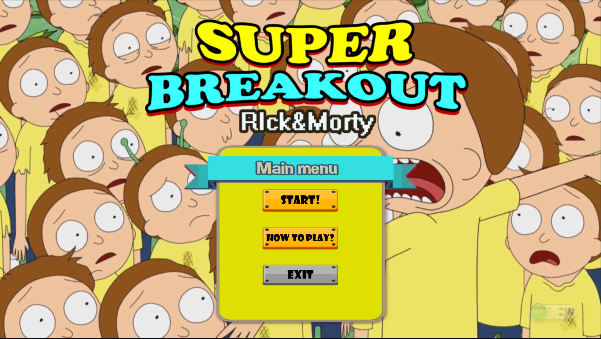
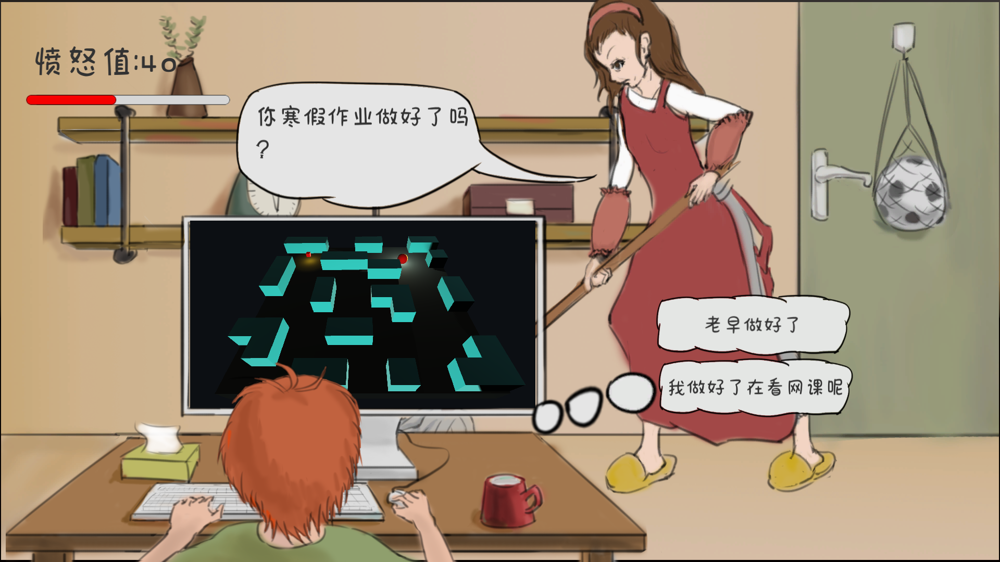
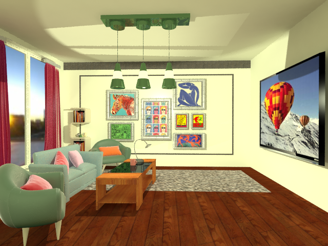

## Projects

---
    
### Build Virtual Worlds 
      
[ROUND1, Platform: HTC VIVE](https://naijiajin.github.io/Round1)

---
[ROUND2, Platform: Magic Leap](https://naijiajin.github.io/Round2)

---
[ROUND3, "Goal" in the wall, Platform: Kinect2.0](https://naijiajin.github.io/Round3)
 

-----  
      
### Undergraduates Projects

[Beyond Eyes- Self Project, Platform: PC](https://naijiajin.github.io/sample_page)     

[Swordsman's Legend, Platformj: Kinect2.0](http://example.com/)

[Rick&Morty SuperBreakout, Platform: PC](http://example.com/)

[Shadow Dancer, 2D, Platform: PC](http://example.com/)

[2019Global Game Jam-Game or Mom, 2D, PC](http://example.com/)

[Livingroom 3D max project](http://example.com/)

---

    

---

